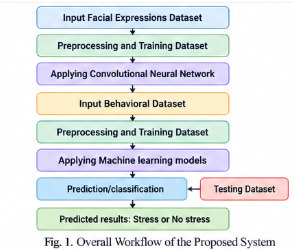
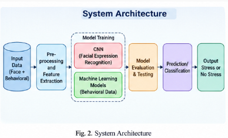
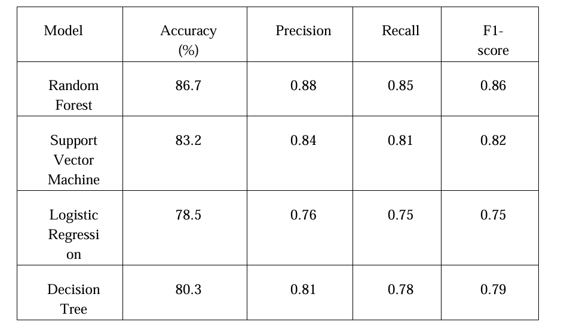
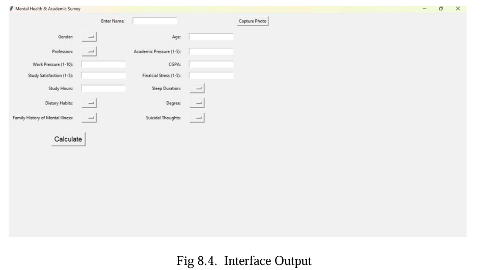
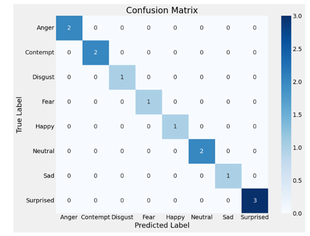
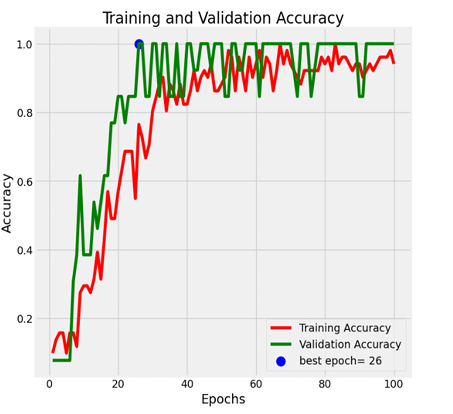
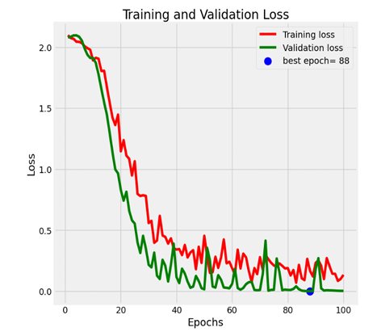
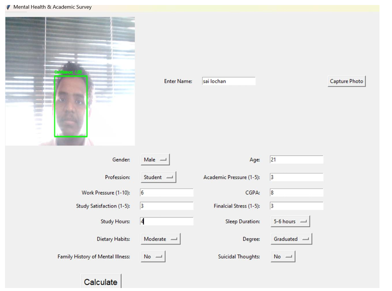
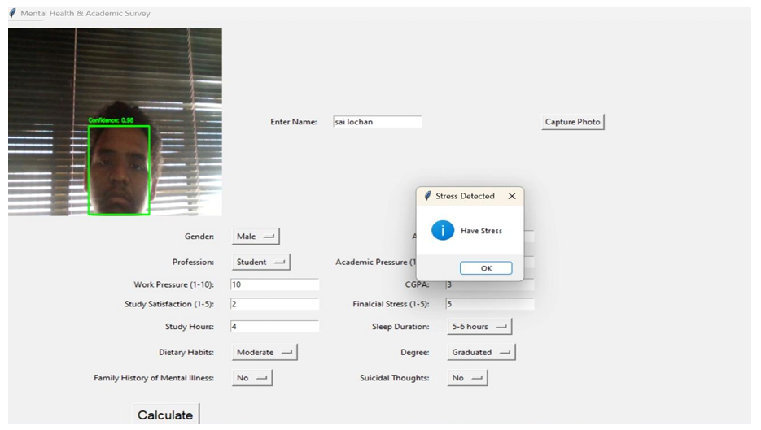

# Mental Health & Stress Detection System

A machine learning and computer vision project that combines **student stress prediction** with **facial emotion recognition**. The project uses demographic/academic/lifestyle information together with an emotion predicted from a captured face image to estimate whether stress is present.

## Project Overview

The system has three main components:

1. **Stress Detection** – a classification pipeline trained on student-related academic, work, lifestyle, and mental-health attributes.
2. **Facial Emotion Recognition** – a CNN that classifies a face image into one of eight emotions.
3. **Desktop GUI** – a Tkinter application that captures a user's photo, collects survey information, predicts the facial emotion, and feeds both sets of information into the stress classifier.

> **Important:** This project is an experimental machine-learning system and should not be treated as a medical or psychological diagnostic tool.

## Features

- Student stress classification.
- Facial emotion classification using a CNN.
- Webcam-based face detection and photo capture.
- Tkinter graphical user interface.
- Data preprocessing and categorical feature encoding.
- Random Forest, Logistic Regression, Decision Tree, and SVM experiments for stress classification.
- CNN training with image augmentation.
- Classification report and confusion-matrix evaluation for emotion recognition.

## Project Structure

```text
.
├── GUI.ipynb
├── face_emotion.ipynb
├── StressDetection.ipynb
├── Student_Depression_Dataset_Updated_Refined_WorkPressure.csv
├── images/
│   ├── 0/
│   ├── 1/
│   ├── 2/
│   ├── 3/
│   ├── 4/
│   ├── 5/
│   ├── 6/
│   └── 7/
├── res10_300x300_ssd_iter_140000.caffemodel
├── deploy.prototxt
├── assets/
│   ├── overall-workflow.png
│   ├── system-architecture.png
│   ├── model-performance-comparison.png
│   ├── confusion-matrix.png
│   ├── training-validation-accuracy.png
│   ├── training-validation-loss.png
│   ├── gui-interface.png
│   ├── gui-face-capture.png
│   ├── gui-stress-result.png
│   └── project-results-infographic.png
└── README.md
```

The exact model/data files are not included in the uploaded notebooks, so they must be placed in the project directory before running the corresponding cells.

## Technologies Used

- Python
- NumPy
- Pandas
- Scikit-learn
- TensorFlow / Keras
- OpenCV
- Matplotlib
- Seaborn
- Tkinter
- Pillow

## 1. Stress Detection

The stress-detection pipeline reads:

```text
Student_Depression_Dataset_Updated_Refined_WorkPressure.csv
```

The dataset contains 27,901 rows and 19 columns in the initial notebook inspection.

Relevant attributes include:

- Gender
- Age
- Profession
- Academic Pressure
- Work Pressure
- CGPA
- Study Satisfaction
- Job Satisfaction
- Sleep Duration
- Dietary Habits
- Degree
- Suicidal-thought history
- Work/Study Hours
- Financial Stress
- Family History of Mental Illness
- Stress
- Emotion

### Data preprocessing

The notebooks perform preprocessing such as:

- Filtering age values below 35.
- Removing zero academic-pressure and study-satisfaction entries.
- Removing `Others` values for dietary habits and sleep duration.
- Dropping `id`, `City`, and `Job Satisfaction` in the GUI training pipeline.
- Converting categorical values into numeric representations.
- Encoding the eight emotion classes as integer labels.
- Dropping missing values.

The emotion labels are:

```python
EMOTIONS = [
    "Anger",
    "Contempt",
    "Disgust",
    "Fear",
    "Happy",
    "Neutral",
    "Sad",
    "Surprised"
]
```

### Models explored

The stress notebook experiments with several classifiers:

- Logistic Regression
- Decision Tree
- Random Forest
- Linear SVM
- RBF SVM
- Sigmoid SVM
- Polynomial SVM

The GUI pipeline ultimately uses a:

```python
RandomForestClassifier(random_state=20)
```

with an 80/20 train-test split.

## 2. Facial Emotion Recognition

The facial emotion model is implemented in `face_emotion.ipynb`.

### Dataset format

The image dataset is expected under:

```text
images/
```

with one directory for each emotion label:

```text
images/
├── 0/
├── 1/
├── 2/
├── 3/
├── 4/
├── 5/
├── 6/
└── 7/
```

The directory-to-emotion mapping follows:

| Label | Emotion |
|---:|---|
| 0 | Anger |
| 1 | Contempt |
| 2 | Disgust |
| 3 | Fear |
| 4 | Happy |
| 5 | Neutral |
| 6 | Sad |
| 7 | Surprised |

The notebook loads images in grayscale and resizes them to:

```text
48 × 48
```

Pixel values are normalized by dividing by `255.0`, and the images are reshaped for CNN input.

The uploaded notebook reports **64 images** in the loaded image array at that stage.

### CNN architecture

The emotion classifier uses a Keras Sequential CNN consisting of:

```text
Conv2D (64 filters)
↓
MaxPooling2D
↓
Conv2D (128 filters)
↓
MaxPooling2D
↓
Conv2D (128 filters)
↓
MaxPooling2D
↓
Flatten
↓
Dense (128)
↓
Dropout (0.5)
↓
Dense (8, Softmax)
```

The model is compiled with:

```python
optimizer="adam"
loss="sparse_categorical_crossentropy"
metrics=["accuracy"]
```

### Data augmentation

The training images are augmented using:

- Rotation
- Zoom
- Width shifting
- Height shifting
- Horizontal flipping

Training is configured for up to 100 epochs with a batch size of 32.

### Evaluation

The notebook evaluates the emotion model using:

- Test loss
- Test accuracy
- Classification report
- Confusion matrix
- Actual-vs-predicted image visualization

## 3. Face Detection and Photo Capture

The GUI uses OpenCV's Caffe-based face detector:

```text
res10_300x300_ssd_iter_140000.caffemodel
deploy.prototxt
```

The webcam is opened using:

```python
cv2.VideoCapture(0)
```

A detected face must have confidence above `0.5` for the capture logic to trigger.

The captured frame is saved as:

```text
<name>.jpg
```

The saved image is then converted to grayscale, resized to `48 × 48`, and passed to the emotion CNN.

## 4. GUI Workflow

The application is built using Tkinter.

The general workflow is:

```text
Start GUI
   │
   ▼
Enter name
   │
   ▼
Capture photo from webcam
   │
   ▼
Detect face
   │
   ▼
Save captured image
   │
   ▼
Predict facial emotion
   │
   ▼
Enter academic / lifestyle information
   │
   ▼
Combine survey features + predicted emotion
   │
   ▼
Random Forest stress prediction
   │
   ▼
Display result
```

The final GUI reports either:

```text
No Stress
```

or:

```text
Have Stress
```


## Results & Screenshots


### Overall Workflow

The overall workflow combines facial-expression processing and behavioral-data processing before the final stress/no-stress classification.



### System Architecture

The architecture illustrates the flow from the facial image dataset through CNN-based emotion recognition, integration with the behavioral dataset, machine-learning classification, and final performance analysis.



### Machine Learning Model Comparison

The reported comparison shows Random Forest achieving the highest accuracy among the evaluated models.

| Model | Accuracy (%) | Precision | Recall | F1-score |
|---|---:|---:|---:|---:|
| Random Forest | 86.7 | 0.88 | 0.85 | 0.86 |
| Support Vector Machine | 83.2 | 0.84 | 0.81 | 0.82 |
| Logistic Regression | 78.5 | 0.76 | 0.75 | 0.75 |
| Decision Tree | 80.3 | 0.81 | 0.78 | 0.79 |



### Combined Project Results

A generated visual summary of the project workflow, architecture, model comparison, training curves, confusion matrix, and GUI results is included below.



### Emotion Recognition — Confusion Matrix

The confusion matrix shows the model's predictions across the eight emotion classes.



### Training and Validation Accuracy

The accuracy curves show the training and validation performance across 100 epochs. The plotted best validation epoch is marked in the figure.



### Training and Validation Loss

The loss curves show the training and validation loss during CNN training. The plotted best epoch is marked in the figure.



### GUI — Initial Interface

The Tkinter interface provides fields for the user's academic, lifestyle, and mental-health-related inputs, along with photo capture and calculation controls.



### GUI — Face Detection and Input

The webcam capture stage detects the user's face and displays the collected survey information in the interface.


### GUI — Stress Prediction

After the required inputs are provided, the application displays the predicted stress result.




## Installation

### 1. Clone or download the project

```bash
git clone <your-repository-url>
cd <your-project-directory>
```

If the project is not hosted on GitHub, simply place all required files in one project directory.

### 2. Create a virtual environment

Windows:

```bash
python -m venv venv
venv\Scripts\activate
```

Linux/macOS:

```bash
python3 -m venv venv
source venv/bin/activate
```

### 3. Install dependencies

```bash
pip install numpy pandas scikit-learn tensorflow opencv-python matplotlib seaborn pillow
```

Tkinter is normally included with standard Python installations on Windows. On Linux, install the appropriate Tk package through your distribution's package manager if necessary.

## Running the Project

### Train the stress model

Open:

```text
StressDetection.ipynb
```

Make sure the CSV file is in the expected location, then run the notebook cells sequentially.

### Train the emotion model

Open:

```text
face_emotion.ipynb
```

Make sure the `images/` directory has the expected numbered emotion folders.

Run the notebook sequentially to:

1. Load the images.
2. Preprocess the images.
3. Split the data.
4. Apply augmentation.
5. Build the CNN.
6. Train the model.
7. Evaluate the model.
8. Generate predictions and a confusion matrix.

### Run the GUI

Open:

```text
GUI.ipynb
```

Run the notebook cells sequentially.

The application requires:

```text
Student_Depression_Dataset_Updated_Refined_WorkPressure.csv
images/
res10_300x300_ssd_iter_140000.caffemodel
deploy.prototxt
```

and the trained CNN/Random Forest objects to be available in the notebook session as used by the GUI code.

## Input Features

The GUI collects information including:

| Feature | Description |
|---|---|
| Gender | Male/Female |
| Age | User age |
| Profession | Student/Other |
| Academic Pressure | Academic pressure level |
| Work Pressure | Work pressure level |
| CGPA | Academic performance |
| Study Satisfaction | Study satisfaction level |
| Work/Study Hours | Daily work/study hours |
| Sleep Duration | Sleep-duration category |
| Dietary Habits | Dietary category |
| Degree | Education level |
| Family History | Family history of mental illness |
| Suicidal Thoughts | Previous suicidal-thought response |
| Financial Stress | Financial stress level |
| Emotion | Emotion predicted from the captured face |

## Model Integration

The key idea of the project is multimodal feature combination:

```text
Structured survey data
        +
Facial emotion prediction
        │
        ▼
Combined feature vector
        │
        ▼
Random Forest classifier
        │
        ▼
Stress prediction
```

The GUI first predicts an emotion from the captured image and then inserts that emotion label into the stress-classification feature vector.

## Important Implementation Notes

### 1. Keep preprocessing consistent

The preprocessing used during training and the preprocessing used in the GUI must produce the same feature representation.

In particular, the notebooks contain explicit numeric mappings for:

- Gender
- Sleep Duration
- Dietary Habits
- Degree
- Profession
- Suicidal Thoughts
- Family History
- Emotion

The GUI contains its own mappings, so these mappings should be checked carefully before using the system for evaluation or deployment.

### 2. Image preprocessing

The emotion notebook normalizes training/test pixels using:

```python
X_train = X_train / 255.0
X_test = X_test / 255.0
```

The GUI resizes the captured image to `48 × 48` and converts it to grayscale before prediction. The inference preprocessing should match the training preprocessing, including normalization.

### 3. Small emotion dataset

The uploaded emotion notebook reports only 64 loaded images at the inspected stage. Consequently, very high validation accuracy should not automatically be interpreted as strong real-world generalization. A substantially larger and independently evaluated dataset would be preferable for a reliable emotion-recognition system.

### 4. Stress prediction is not a diagnosis

The output represents the prediction of a machine-learning classifier based on the supplied features. It should not be interpreted as a clinical diagnosis or as a definitive assessment of a person's mental-health condition.

## Possible Improvements

- Save trained models to `.keras`, `.h5`, or compatible serialized formats.
- Save the complete preprocessing pipeline so training and inference use identical transformations.
- Increase the facial-expression dataset substantially.
- Use a dedicated face crop instead of the complete captured frame for emotion inference.
- Normalize the GUI image before passing it to the CNN.
- Add input validation and clear acceptable ranges to all GUI fields.
- Add confidence scores for emotion predictions.
- Evaluate stress models with precision, recall, F1-score, ROC-AUC, and cross-validation rather than accuracy alone.
- Compare class imbalance and perform appropriate balancing if required.
- Separate training code from inference/deployment code.
- Replace notebook-based execution with a Python application for easier deployment.
- Add model persistence and versioning.
- Add privacy controls for captured images.

## Limitations

- The project is notebook-based and requires the models to exist in the active Python session as currently implemented.
- The webcam requires a working camera and appropriate operating-system permissions.
- The face detector depends on the Caffe model files being present.
- The emotion dataset used in the notebook is very small at the inspected stage.
- The GUI and training notebooks contain different categorical mappings that should be aligned before final deployment.
- The GUI currently saves captured photographs using the entered name, so filename collisions and privacy considerations should be addressed in a production version.
- Predictions can be affected by image quality, lighting, face position, camera quality, and dataset bias.

## Ethical and Privacy Considerations

This project processes potentially sensitive information, including mental-health-related survey responses and facial images.

For any real-world deployment:

- Obtain informed consent before collecting images or survey data.
- Avoid storing photographs unless necessary.
- Protect stored data using appropriate access controls and encryption.
- Do not use the model as the sole basis for high-impact decisions.
- Clearly communicate that predictions are probabilistic.
- Provide users with an option to stop data collection.

## License

No license is specified in the provided notebooks. If this project is published publicly, add an appropriate license here.

## Author

**Greeshma Rednam**

---

If you use this project for academic or research purposes, describe the results as experimental model predictions and include the dataset/model details used for your particular experiment.
